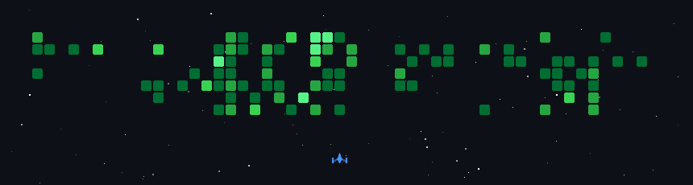

<picture>
				<source media="(prefers-color-scheme: light)" src="light-header.svg">
				<source media="(prefers-color-scheme: dark)" srcset="dark-header.svg">
				
</picture>

# 💫 About Me:
🔭 I’m currently studying at the University of Málaga 👯 I’m looking to collaborate on projects related to AI 🌱 I’m currently learning Angular ⚡ I love wine, rebujito and Diego el Cigala

# 💻 Tech Stack:

  
  
  
  
  
  
  
  
  
  
  
  
  
  
  
  
  
  
  

# 👀 Last LinkedIn posts
<!-- BEGIN LINKEDIN-CARDS -->

  <a href="https://www.linkedin.com/posts/alexcerezocontreras_kubernetes-cncf-cloudnative-activity-7457383770065817602-NoMN?utm_source=social_share_send&utm_medium=member_desktop_web&rcm=ACoAAGjqhaIBDnyikIS9mZSXYGf4QakNabyQTY8">
    <picture>
      <source media="(prefers-color-scheme: dark)" srcset="https://github.com/alexcerezo/alexcerezo/blob/main/cards/1777978842274-dark.svg">
      <source media="(prefers-color-scheme: light)" srcset="https://github.com/alexcerezo/alexcerezo/blob/main/cards/1777978842274-light.svg">
      
    </picture>
  </a>
  <a href="https://www.linkedin.com/posts/alexcerezocontreras_aws-devops-cloud-activity-7455551339629215744-rL6y?utm_source=social_share_send&utm_medium=member_desktop_web&rcm=ACoAAGjqhaIBDnyikIS9mZSXYGf4QakNabyQTY8">
    <picture>
      <source media="(prefers-color-scheme: dark)" srcset="https://github.com/alexcerezo/alexcerezo/blob/main/cards/1777541956813-dark.svg">
      <source media="(prefers-color-scheme: light)" srcset="https://github.com/alexcerezo/alexcerezo/blob/main/cards/1777541956813-light.svg">
      
    </picture>
  </a>
  <a href="https://www.linkedin.com/posts/alexcerezocontreras_devops-cloudcomputing-informaticauma-activity-7449858803501535232-GIqE?utm_source=social_share_send&utm_medium=member_desktop_web&rcm=ACoAAGjqhaIBDnyikIS9mZSXYGf4QakNabyQTY8">
    <picture>
      <source media="(prefers-color-scheme: dark)" srcset="https://github.com/alexcerezo/alexcerezo/blob/main/cards/1776184750438-dark.svg">
      <source media="(prefers-color-scheme: light)" srcset="https://github.com/alexcerezo/alexcerezo/blob/main/cards/1776184750438-light.svg">
      
    </picture>
  </a>
  <a href="https://www.linkedin.com/posts/alexcerezocontreras_la-revoluci%C3%B3n-de-los-llm-en-el-deporte-thu-activity-7442669906057277440-GdIN?utm_source=social_share_send&utm_medium=member_desktop_web&rcm=ACoAAGjqhaIBDnyikIS9mZSXYGf4QakNabyQTY8">
    <picture>
      <source media="(prefers-color-scheme: dark)" srcset="https://github.com/alexcerezo/alexcerezo/blob/main/cards/1774470783724-dark.svg">
      <source media="(prefers-color-scheme: light)" srcset="https://github.com/alexcerezo/alexcerezo/blob/main/cards/1774470783724-light.svg">
      
    </picture>
  </a>

<!-- END LINKEDIN-CARDS -->

# 🎥 Last videos

<!-- BEGIN YOUTUBE-CARDS -->

<!-- END YOUTUBE-CARDS -->

# 📊 GitHub Stats

> [!NOTE]
> This README has been optimized for accessibility based on GitHub's blogpost "[Tips for Making your GitHub Profile Page Accessible](https://github.blog/2023-10-26-5-tips-for-making-your-github-profile-page-accessible)".
