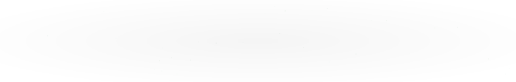

<picture>
				<source media="(prefers-color-scheme: light)" src="light-header.svg">
				<source media="(prefers-color-scheme: dark)" srcset="dark-header.svg">
				
</picture>

# 💫 About Me:
🔭 I’m currently studying at the University of Málaga and working at Ericsson 👯 I’m looking to collaborate on projects related to AI 🌱 I’m currently learning Toy Models ⚡ I love wine, rebujito and Diego el Cigala

# 💻 Tech Stack:

  
  
  
  
  
  
  
  
  
  
  
  
  
  
  
  
  
  
  

# 👀 Last LinkedIn posts
<!-- BEGIN LINKEDIN-CARDS -->

  <a href="https://www.linkedin.com/posts/alexcerezocontreras_dev-days-c%C3%B3rdoba-spain-luma-activity-7514630235552800768-sJJ6?utm_source=social_share_send&utm_medium=member_desktop_web&rcm=ACoAAG9_BksBnw8WA2v45YWNKE1DMS27BmFLHgQ">
    <picture>
      <source media="(prefers-color-scheme: dark)" srcset="https://github.com/alexcerezo/alexcerezo/blob/main/cards/1791627463234-dark.svg">
      <source media="(prefers-color-scheme: light)" srcset="https://github.com/alexcerezo/alexcerezo/blob/main/cards/1791627463234-light.svg">
      
    </picture>
  </a>
  <a href="https://www.linkedin.com/posts/alexcerezocontreras_dev-days-m%C3%A1laga-spain-luma-activity-7514268251715964928-rdm5?utm_source=social_share_send&utm_medium=member_desktop_web&rcm=ACoAAG9_BksBnw8WA2v45YWNKE1DMS27BmFLHgQ">
    <picture>
      <source media="(prefers-color-scheme: dark)" srcset="https://github.com/alexcerezo/alexcerezo/blob/main/cards/1791541159562-dark.svg">
      <source media="(prefers-color-scheme: light)" srcset="https://github.com/alexcerezo/alexcerezo/blob/main/cards/1791541159562-light.svg">
      
    </picture>
  </a>
  <a href="https://www.linkedin.com/posts/alexcerezocontreras_dev-days-c%C3%B3rdoba-spain-luma-activity-7513905429215866880-Yod1?utm_source=social_share_send&utm_medium=member_desktop_web&rcm=ACoAAG9_BksBnw8WA2v45YWNKE1DMS27BmFLHgQ">
    <picture>
      <source media="(prefers-color-scheme: dark)" srcset="https://github.com/alexcerezo/alexcerezo/blob/main/cards/1791454655937-dark.svg">
      <source media="(prefers-color-scheme: light)" srcset="https://github.com/alexcerezo/alexcerezo/blob/main/cards/1791454655937-light.svg">
      
    </picture>
  </a>
  <a href="https://www.linkedin.com/posts/alexcerezocontreras_linkedin-ya-no-es-una-red-social-est%C3%A1-muerto-activity-7511820590631174145-4HfZ?utm_source=social_share_send&utm_medium=member_desktop_web&rcm=ACoAAG9_BksBnw8WA2v45YWNKE1DMS27BmFLHgQ">
    <picture>
      <source media="(prefers-color-scheme: dark)" srcset="https://github.com/alexcerezo/alexcerezo/blob/main/cards/1790957591684-dark.svg">
      <source media="(prefers-color-scheme: light)" srcset="https://github.com/alexcerezo/alexcerezo/blob/main/cards/1790957591684-light.svg">
      
    </picture>
  </a>

<!-- END LINKEDIN-CARDS -->

# 🎥 Last videos

<!-- BEGIN YOUTUBE-CARDS -->

<!-- END YOUTUBE-CARDS -->

<!-- BEGIN ACTIVITY-GRAPH -->
<picture>
  <source media="(max-width: 767px)" srcset="activity-graph-mobile.svg">
  
</picture>
<!-- END ACTIVITY-GRAPH -->

> [!NOTE]
> This README has been optimized for accessibility based on GitHub's blogpost "[Tips for Making your GitHub Profile Page Accessible](https://github.blog/2023-10-26-5-tips-for-making-your-github-profile-page-accessible)".
